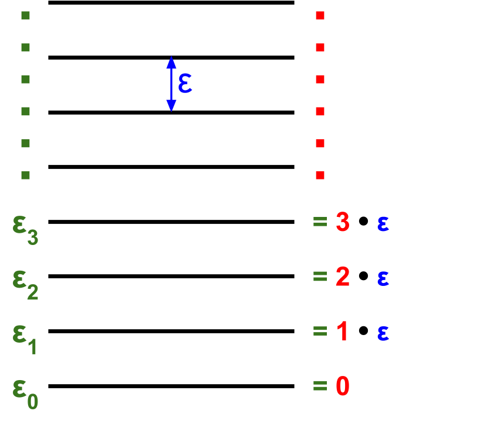

# Deriving Partition Function $$q$$ for an Equidistant ladder of Energy Levels
Partition functions give a measure of how many energy levels are available given temperature and molecular conditions. 

For an equidistant ladder, the distance between energy levels is a constant $$\varepsilon$$

## Consider the partition function for a harmonic oscillator
$$\begin{align*}
q &= e^{-0 \beta \varepsilon} + e^{-1 \beta \varepsilon} + e^{-2 \beta \varepsilon} + \ldots \\
&= 1 + {\left( e^{- \beta \varepsilon} \right)}^{1} + {\left( e^{- \beta \varepsilon} \right)}^{2} + \ldots 
\end{align*}$$

If we let $$x = e^{- \beta \varepsilon}$$, we can simplify this equation to

$$q = 1 + x + x^2 + \ldots$$

This gives us a power series. Assuming $$x = e^{- \beta \varepsilon} < 1$$, we can multiply by $$\frac{1-x}{1-x}$$ to further simplify this equation

$$\begin{align}
q &= \frac{(1-x)}{(1-x)} \left( 1 + x + x^2 + \ldots \right) \\
&= \frac{(1 + x + x^2 + \ldots)-(x + x^2 + x^3 + \ldots)}{(1-x)} \\
&= \frac{1}{(1-x)}
\end{align}$$

Thus the partition function for an equidistant ladder of energy levels is

$$q = \frac{1}{1-e^{- \beta \varepsilon}}$$